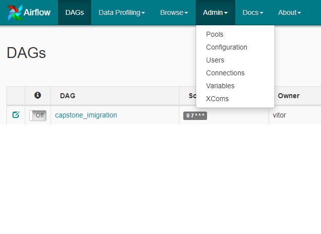
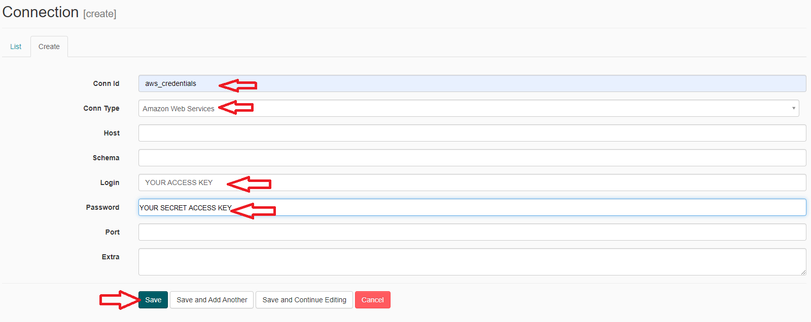
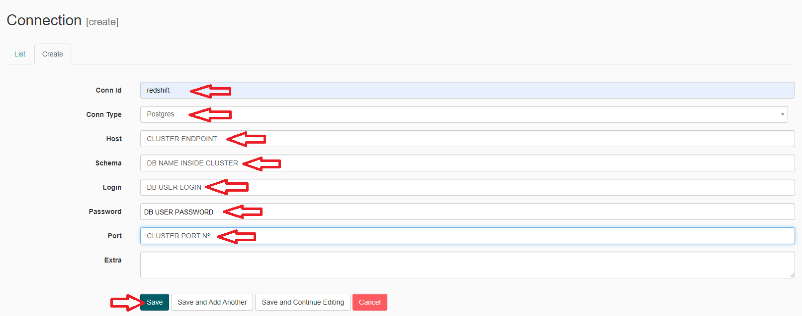
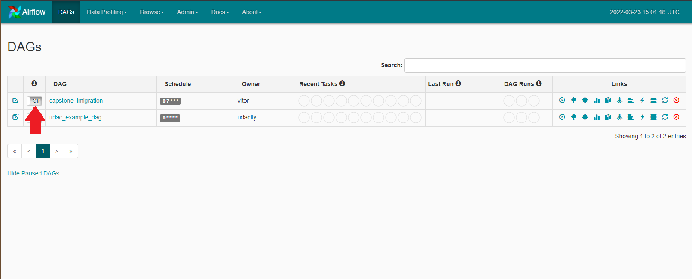
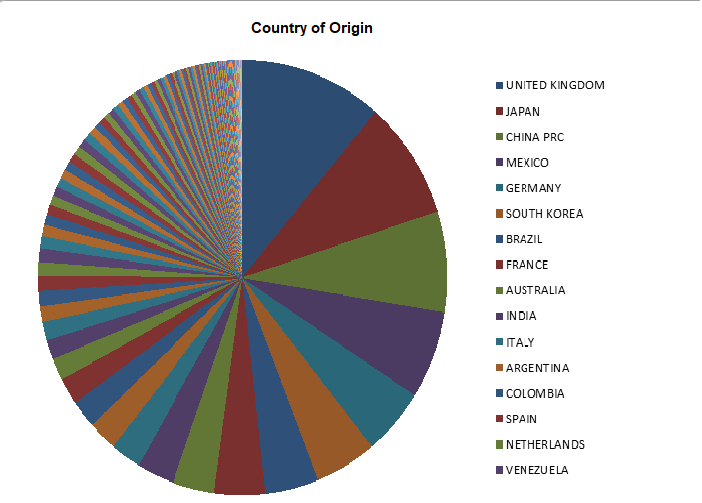
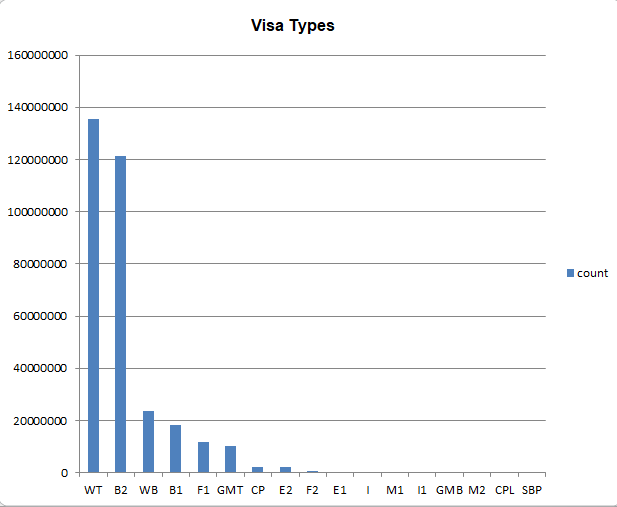

# Capstone Project - Udacity
This is the final project for Udacity's Data Engineering Nano-degree.
It uses the data provided by Udacity to perform an analysis of the imigrants to the US in the year 2016. 
The provided data contained non-uniform file types such as SAS files, csv (with both commas end semicolons delimiters) and parquet files, all 
of which were processed accordingly to be used in the project. More about these files wil be mentioned in the 'Source Data' section. 

The focus for this project was to look the imigrant data with a point of view in infrastructure planning: which areas or personel should be given priority to increase efficiency? For example, if most imigrants come from Spanish speaking countries then it would make the airport and other facilities faster if the employees could speak the language. Or even if most imigrants come during a certain month, hotels should increase staff to better accomodate them during this time of year. 

## Summary
1. Source Data
2. Data Model
3. Data Purpose and Insights
4. Project tools
5. Setups and Requirements
6. Examples
7. Future Cases Scenarios

### 1. Source Data

The source data includes: 
- I94 Imigration data from 2016 (.sas7bdat): This data comes from the US National Tourism and Trade Office. [This](https://www.trade.gov/national-travel-and-tourism-office) is where the data comes from. 
- World Temperature Data (.csv): This dataset came from Kaggle. You can read more about it [here](https://www.kaggle.com/berkeleyearth/climate-change-earth-surface-temperature-data).
- U.S. City Demographic Data (.csv): This data comes from OpenSoft. You can read more about it [here](https://public.opendatasoft.com/explore/dataset/us-cities-demographics/export/).
- Airport Code Table (.csv): This is a simple table of airport codes and corresponding cities. It comes from [here](https://datahub.io/core/airport-codes#data).
- I94 port label (.csv): this file was created from the data dictionary of I94 imigration data. In contains the codes, cities and states of the ports.
- I94 country label (.csv): this file was created from the data dictionary of I94 imigration data. It contains the code and respective name of the country for the I94 columns. 

Some considerations about the datasets: 
1. The I94 imigration data provided uses local codes for its ports under the I94port column which does not match the global airport codes used internationaly in the Airport Code Table. Therefore, in order to perform an aproximate analysis, the cities where the airport are located were used as joining condition.
2. The I94 data was originally given as SAS file (.sas7bdat) but it was pre-processed to parquet files in order to better work with the project tools. Also, the Jun2016 portion contained extra columns which did not match the schema from the other files and were removed. 
3. To make the CSV files more uniform, all the delimiters were changed to ','.

### 2. Data Model

For this project a star-schema model was selected since most of the decisions are based on the imigration data and all others tables serve as complements to it. 

#### The fact table 
- imigration_table [ entry_id, i94yr, i94mon, residence, destination, i94port, arrdate, i94port, i94mode, arriv_date, dept_date, stay_duration, age, visatype, gender] PK = entry_id, FK = i94port, country_code(used in residence column)

#### Dimension tables
- land_temp_table [ year, city, country, average_temperature] 
- airport_table [ ident, type, name, city, country, i94port] PK=ident, FK= i94Port
- us_city_demo [ city, state, state_code, median_age, male_pop, female_pop, foreign_born] 
- stage_country_label [country_code, name] PK = country_code
- stage_port_name [i94port_code, city, state] PK = i94port_code

### 3. Data Purpose and Insights

As mentioned in the introduction, this project data model was thought out to prep the data for a city infrastructure implementation point of view. Such as hotel and airport staff, public vehicles, general workers and tourists hubs. 

Some of the questions an infrastructure worker could be interested in: 
- What is the average age of the visitors? Younger tourist normally use buses and trains to move around due to cost, but older ones may prefer more private transportation such as taxis. 
- What purpose do most visitors enter the US for? Business, pleasure, academics, depending on what they mean to do during their stay diferents accomodations may be necessary. 
- From where do most visitors come from? Airport and tourist hub's personel should be qualified to deal with the incomming public.
- When do most imigrants arrive? Temporary workers may be necessary to suplement the extra workload.

### 4. Project Tools

Given the size of the data source, this project couldn't be ran in a local machine, so a cloud approach was selected.

This project used several services from Amazon's AWS. All the source data is being stored inside an S3 bucket, allowing for an easy scalability should more data need to be stored. Similarly, all the processing and database storage is being held in a Redshift cluster which can also be modified to provide more processing power if the data requeriments increase by 100x. And finally, all the etl processes are being controlled by an Apache Airflow DAG, which can controll the running schedule. 

- S3 Bucket: easily expanded storage, can be upgraded according to needs.
- Apache Airflow: core unit of the project, it controls the runnign schedule for the project (7am daily) as well as all the processes required: connect to s3 and redshift, its workers send comands to stage the data in redshfit and perform the necessary transformations and quality checks. 
- Amazon Redshift: the Data Warehouse and processing unit of the project, it receives comands from airflow to perform the etl. Its cluster can be upgraded to provide more processing power and storage to the database. 

### 5. Setups and Requirements

This project needs a Redshift Cluster and Airfow, below are setup instructions. 

### 5.1. Airflow
Since this project runs in Airflow it is necessary to have it installed in your machine. 

You can follow this [link](https://github.com/puckel/docker-airflow) on instructions how to do it. 

With airflow installed, copy the contents of our airflow dag's and pluggins's folders into the instalation path's respective folders. 

Once you are able to run Airflow, it is necessary to establish the connections to redshift cluster and AWS

After the connections are created, activate the dag, it should start automatically as per schedule. 

#### 5.2. Redshift 

The redshift cluster for this project was created as a DC2Large with 2 nodes. Depending on the increase for the database requirements this can be further upgraded. 

Remember to copy the cluster endpoint, db name, user and password, these are necessary to setup the connections in airflow as mentioned in the previous section.

The creation of tables in the database is done inside the dag. 

### 6. Examples

1. Where do most imigrants come from? 

`
SELECT cl.country_name, COUNT(*)
FROM stage_country_label cl
JOIN imigration_table it
ON it.cntry_residence=country_code
GROUP BY 1
ORDER BY 2 DESC
`

2. What are the most common visatypes?

`
SELECT visatype, COUNT(*) 
FROM imigration_table 
GROUP BY 1
ORDER BY 2 DESC
`

### 7. Future Cases Scenarios

As per the rubrics instructions, some scenarios need to be addressed: 

1. The data was increased by 100x. 
	This was already explained in the tools section, but redshift can easily be upgraded or downgraded depending on the project needs. Therefore, the solution to this problem would be to increase the cluster capacity to an appropriate value.

2. The pipelines would be run on a daily basis by 7 am every day.
	This scenario is implemented in the current pipeline. Airflow is scheduled to run the dag everyday at 7am. 

3. The database needed to be accessed by 100+ people.
	This can be achieved using the [DATA SHARING tool](https://docs.aws.amazon.com/redshift/latest/dg/datashare-overview.html) in Amazon. It gives access to the data without need to move or copy it manually.

